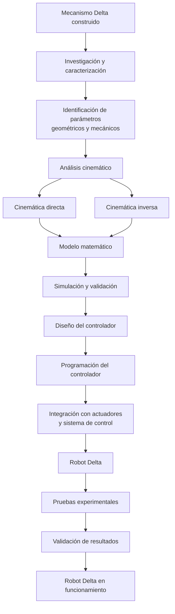

# 🤖 Robot Delta — Análisis, Control y Puesta en Funcionamiento

## 📌 Descripción

Este repositorio contiene el desarrollo de un proyecto orientado a la **puesta en funcionamiento y control de un robot Delta**. El punto de partida del proyecto es un **mecanismo Delta previamente construido** , sobre el cual se realizará el estudio, análisis y desarrollo necesario para lograr su operación controlada.

El proyecto comprende una etapa de **investigación de mecanismos**, el desarrollo de su **modelo y análisis cinemático**, y posteriormente la **programación del controlador** encargado de coordinar el movimiento de los actuadores del robot.

El objetivo final es integrar los resultados obtenidos en las diferentes etapas para conseguir un robot Delta capaz de ejecutar movimientos definidos de manera controlada.

---

## 🎯 Objetivos

### Objetivo general

Desarrollar e implementar el sistema necesario para poner en funcionamiento un robot Delta previamente construido, mediante el análisis de su mecanismo, el desarrollo de su modelo cinemático y la programación de un controlador de movimiento.

### Objetivos específicos

* Investigar el funcionamiento y las características de distintas cadenas cinematicas (Cadenas Abiertas y Cerradas).
* Identificar la estructura mecánica, grados de libertad y componentes del mecanismo existente.
* Desarrollar el **análisis cinemático** del robot.
* Obtener las relaciones entre las posiciones del efector final y los movimientos de los actuadores.
* Implementar y validar el modelo cinemático mediante herramientas computacionales.
* Diseñar y programar el controlador del robot.
* Integrar el controlador con el sistema mecánico y los actuadores disponibles.
* Realizar pruebas de movimiento y validar el funcionamiento del robot.
* Documentar el proceso de desarrollo, resultados y pruebas realizadas.

---

## 🧩 Punto de partida

El proyecto parte de un **mecanismo Delta previamente construido**, por lo que el desarrollo no contempla inicialmente la fabricación de la estructura mecánica.

El trabajo se concentra principalmente en:

---

## 📚 Etapas del proyecto

### 1. [Investigación de Cadenas Cinematicas( Movilidad y DOFs)](Analisis_cinematico/Readme.md)

### 2. [Análisis cinemático](Cinematica/Readme.md)

### 3. [Modelado y simulación](Simulacion/Readme.md)

### 4.[Evidencias y Resultados](Resultados/Readme.md)

##  📰Referencias

1. Tsai, L.-W. (1999). *Robot Analysis: The Mechanics of Serial and Parallel Manipulators*. John Wiley & Sons.
